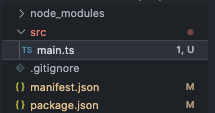
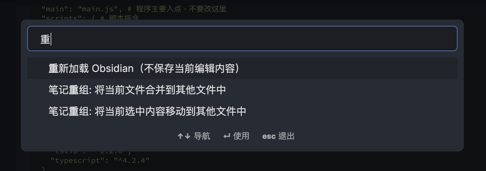
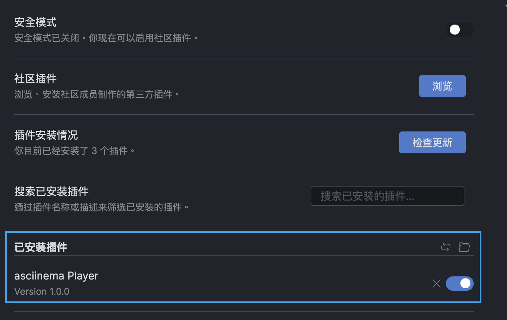

# `asciinema-player` 插件开发记录

#typescript #obsidian-plugin #rollup #前端

## 说明

[如何离线使用 asciinema](https://unix.stackexchange.com/questions/512450/how-to-use-asciinema-offline)
[asciinema-player 官方 API 指南 · asciinema/asciinema-player](https://github.com/asciinema/asciinema-player/blob/develop/README.md#use-the-player-in-your-html-page)

## 初始化

### 创建仓库

去 [obsidian-sample-plugin](https://github.com/obsidianmd/obsidian-sample-plugin) 获取样例插件，可以使用 GitHub 自带的 **Use this template**（使用这个模版）来快速创建副本到自己的 GitHub 账号

### 克隆仓库到本地

一般放置到插件的目录在  `<知识库路径>/.obsidian/plugins/<插件名>` ，如果你变更过 Obsidian 的配置文件路径，把 `.obsidian` 改成你想要的即可。

```shell
git clone github.com/<用户名>/<仓库名> <知识库路径>/.obsidian/plugins/<插件名>
```

以我的为例：

```shell
git clone nekomeowww.git:nekomeowww/obsidian-asciinema-player.git
```

### 安装依赖

```shell
pnpm i
```

### 变更插件信息

编辑 `manifest.json` 来调整插件的名称、作者、简介和版本等信息。

```javascript
{
 "id": "obsidian-asciinema-player", # 插件 ID，不可以与社区已经存在的插件重复
 "name": "asciinema Player", # 插件名称
 "version": "1.0.0", # 插件版本号
 "minAppVersion": "0.9.12", # 要求的 Obsidian 最小版本号
 "description": "", # 简介
 "author": "Ayaka Neko", # 作者
 "authorUrl": "https://github.com/nekomeowww", # 作者地址
 "isDesktopOnly": false # 决定了使用的是 Node API（跨平台） 还是 Electron API（桌面端）
}
```

编辑 `package.json` 文件来调整最终发布的 npm 包信息。

```javascript
{
  "name": "obsidian-asciinema-player", # npm 包名称
  "version": "1.0.0", # 版本号
  "description": "", # 简介
  "main": "main.js", # 程序主要入点，不要改这里
  "scripts": { # 脚本指令
    "dev": "rollup --config rollup.config.js -w", # 热加载插件
    "build": "rollup --config rollup.config.js --environment BUILD:production" # 构建发布版本
  },
  "keywords": [], # 关键字
  "author": "Ayaka Neko", # 作者
  "license": "MIT",
  "devDependencies": {
    "@rollup/plugin-commonjs": "^18.0.0",
    "@rollup/plugin-node-resolve": "^11.2.1",
    "@rollup/plugin-typescript": "^8.2.1",
    "@types/node": "^14.14.37",
    "obsidian": "^0.12.0",
    "rollup": "^2.32.1",
    "tslib": "^2.2.0",
    "typescript": "^4.2.4"
  }
}
```

### 调整文件夹结构

一般情况下源代码都会被放置在 `src` 目录中，我们可以创建一个 `src` 目录，把 `main.ts` 放进去。



然后去 `rollup.config.js` 文件中调整我们编译的程序入点路径：

```javascript
export default {
  input: 'src/main.ts' # 把 input 字段的值从 main.ts 改成 src/main.ts
  ...
}
```

### 编译并开启热加载

```shell
pnpm dev
```

现在对 `main.ts` 及其依赖的文件都会被自动编译到 `main.js` 文件中。

### 在 Obsidian 中激活我们的插件

1. 先重新加载 Obsidian



2. 在插件列表中激活我们的插件



## 插件结构

在案例插件的 `main.ts` 代码文件中可以看到：

```TypeScript
import { App, Modal, Notice, Plugin, PluginSettingTab, Setting } from 'obsidian'

/**
 * MyPlugin 拓展了 obsidian 的 Plugin（插件）实现
 * MyPlugin 同时是一个默认的导出对象，也就是说插件默认从这个位置挂载
 */
export default class MyPlugin extends Plugin {
  // 定义了设定的结构
  settings: MyPluginSettings;
 
  // onload 是默认挂载插件时执行的事件函数
  async onload() {
    // TODO
  }
  // onunload 是插件卸载时执行的的事件函数
  onunload() {
    // TODO
  }
}

/**
 * SampleSettingTab 拓展了 obsidian 的 PluginSettingTab（插件设定选项卡）实现
 */
class SampleSettingTab extends PluginSettingTab {
}
```

在 Obsidian 的[Obsidian 官方文档参考](Obsidian%20%E5%AE%98%E6%96%B9%E6%96%87%E6%A1%A3%E5%8F%82%E8%80%83.md)中可以得知：必须使用 `export default class` 导出一个扩展 `Plugin` 的默认类，所以我们的插件要基于拓展的 Plugin 类完成。

## 开始编写

### i18n 支持

在 `src` 下创建 `locales` 目录，以及 `locales` 目录下的 `lang` 文件夹和 `helpers.ts` 文件。

1. 在 `helpers.ts` 文件中，我们将会构建 i18n 的主要函数 `t`
2. 在 `lang` 文件夹中，将会保存我们需要的本地化文件

在 `locales/lang` 目录下创建我们的默认语言 English（英文）的本地化文件 `en.ts`，以及简体中文的本地化文件 `zh-cn.ts`，这两个文件的结构都一致：

```typescript
export default {
}
```

在 `helpers.ts` 中写下下面的内容：

```typescript
import { moment } from 'obsidian' // 导入 moment

// 导入本地化文件
import en from './lang/en'
import zhCN from './lang/zh-cn'

// 创建字典
const localeMap: { [k: string]: Partial<typeof en> } = {
    en,
    "zh-cn": zhCN,
}

// obsidian 中的 moment.locale() 函数可以用于获取黑曜石的语言
const locale = localeMap[moment.locale()]

/**
 * @params {String} str - i18n 本地化键值
 * @returns 本地化字符串
 */
export function t(str: keyof typeof en): string {
  // 如果 locale 不存在，则打印错误
  if (!locale) {
    console.error("Error: Plugin obsidian-asciinema-player locale not found", moment.locale());
  }

  // 如果 locale 或是 locale[str] 未定义，自动回退到 en（英文）
  return (locale && locale[str]) || en[str]
}
```

这样我们在任何一个地方导入 `helpers.ts` 就可以使用 i18n 了。
