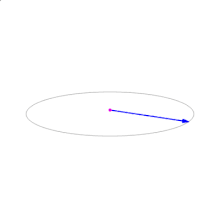
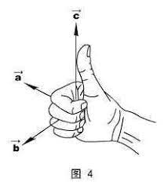

# ✖️ 叉乘

### $a \times b$


点乘被用于向量和一维矩阵的计算，叉乘的计算结果`c`是一个新的向量。

#### 几何意义

* 两个向量的叉积`c`与这两个向量组成的坐标平面垂直，`c`向量长度在两个向量平行时为零。

* 因为叉乘的反交换律：“ $\begin{equation}\begin{split} & a\times \ b = c \\ & b \times a = -c\\ \end{split}\end{equation}$  ” 所以可以通过 `c` 向量的方向来判断 `b` 向量是在 `a` 的左边还是右边。

* 假设有一点`d` 和一个三角形，通过遍历三角形所有边并叉乘点 `d` 的相对位置，还可以得出点`d`是在三角形的内侧还是外侧。



##### 使用右手定则确定叉乘结果向量的方向

这两种方法都可以，第一种更好记一些。



#### 计算方法

$$
\begin{equation}\begin{split} 
c_x = a_yb_z - a_zb_y \\
c_y = a_zb_x - a_xb_z \\
c_z = a_xb_y - a_yb_x \\
\end{split}\end{equation}
$$

### 代码实现

```typescript
export function crossProduct(vA: number[], vB: number[]) {
  const product = (t = 0, v = 0) => t * v
  const itemCrossProduct = (mA: number[], mB: number[]) => {
    return mA.reduce(product) - mB.reduce(product)
  }
  return [
    itemCrossProduct([vA[1], vB[2]], [vA[2], vB[1]]),
    itemCrossProduct([vA[2], vB[0]], [vA[0], vB[2]]),
    itemCrossProduct([vA[0], vB[1]], [vA[1], vB[0]]),
  ]
}
```


### 参考资料

https://www.shuxuele.com/algebra/vectors-cross-product.html

https://zh.wikipedia.org/wiki/%E5%8F%89%E7%A7%AF