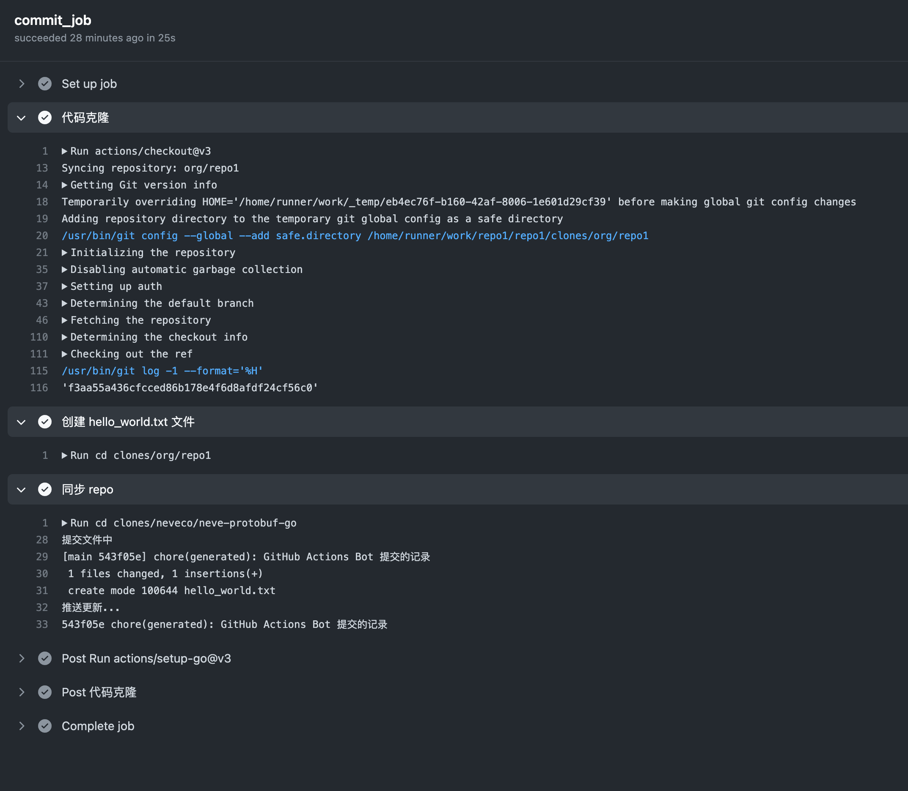

---
tags:
  - 网站/GitHub
  - 开发/CICD
  - 开发/CICD/GitHub-Actions
  - 开发/标记语言/YAML
  - 开发/DevOps
  - 开发/容器/Docker
  - 开发/云原生/Docker
  - 开发/API/GraphQL
  - 开发/API/Protobuf
  - 开发/API/Swagger
  - 开发/API/OpenAPI
  - 命令行/git
  - 开发/git
---
# 仓库内的 GitHub Actions 工作流使用 GitHub Actions Bot 来提交

## 说明

我们可能会需要通过 GitHub Actions 联动触发并构建诸如 Swagger API 文档、Swagger API 生成代码、GraphQL 生成代码、Protobuf 生成代码之类的文件或是项目，在构建之后提交到仓库内，这个时候我们可以利用到 Github Actions 提供的工作流内 Token 和官方预置的机器用户 GitHub Actions Bot 来推送我们新的提交，这样做也可以避免将自动构建的 Commit 和贡献数量计入到管理员账号名下，也可以一目了然的看出来具体是 Bot 提交的还是人为干预提交的。

## 实践方法

```yaml
name: 工作流名称

concurrency: concurrency-key

on:
  workflow_dispatch:

jobs:
  commit_job:
    runs-on: ubuntu-latest
    steps:
      - name: 代码签出
        uses: actions/checkout@v3
        with:
          repository: org/repo1
          token: ${{ secrets.ACCESS_TOKEN }}
          path: clones/org/repo1

      - name: 创建 hello_world.txt 文件
        run: |
            cd clones/org/repo1
            echo 'Hello, world!' >> hello_world.txt

      - name: 同步 repo
        run: |
          cd clones/org/repo1
          bash -c 'if [ $(git status --porcelain | wc -l) -eq 0 ]; then
            echo "工作树无变更，跳过提交步骤..."
          else
            echo "提交文件中..."
            git config user.name "github-actions[bot]"
            git config user.email "github-actions[bot]@users.noreply.github.com"
            git add .
            git commit -m "chore(generated): GitHub Actions Bot 提交的记录"
            git log -3 --oneline
            echo "推送更新中..."
            git push
          fi'
```

### 工作流说明

在上述文件中我们创建了一个有 3 个步骤的工作流。

首先需要注意的是第二行的 `concurrency` 属性，设定该属性可以避免多个工作流并发运行从而导致错误生成版本不正确的代码影响业务开发，关于 `concurrency` 可以在 [官方文档](https://docs.github.com/en/actions/using-jobs/using-concurrency) 中找到更多详细内容。

其次是我们使用了 `actions/checkout@v3` 工作流插件来使用预先配置的 Secret `secrets.ACCESS_TOKEN` 去克隆 `org` 组织名下的 `repo1` 仓库到本地 `clones/org/repo1` 目录下。

接下来我们使用简单的命令 `echo 'Hello, world!' >> hello_world.txt` 在 `clones/org/repo1` 目录下创建了一个内容为 `Hello, world!` 名为 `hello_world.txt` 的文件。

我们在第三部执行中先切换到 `clones/org/repo1` 目录，然后通过 `bash -c '<脚本>'` 命令来执行一段多行且带有逻辑判断的脚本。`git status --porcelain | wc -l` 用于统计当前工作区下的文件变更数量，如果我们不需要提交的时候就跳过提交了。反之我们需要将自己的用户配置为用户名为 `github-actions[bot]` 和邮箱为 `github-actions[bot]@users.noreply.github.com` 的用户，然后创建我们的提交 `chore(generated): GitHub Actions Bot 提交的记录`，最后通过 `git push` 推送到远程分支上。

### 细节和原理说明

工作流文件中最关键的地方在于这两行：

```bash
git config user.name "github-actions[bot]"
git config user.email "github-actions[bot]@users.noreply.github.com"
```

这会将我们的用户配置为用户名为 `github-actions[bot]` 和邮箱为 `github-actions[bot]@users.noreply.github.com` 的用户，推送到 GitHub 之后就可以看到下面带有头像且名称为 `github-actions[bot]` 的提交记录啦。


### 工作流执行结果



## 参考资料

- [How can commits show "github actions bot" instead of Unknown ? · Discussion #479 · actions/checkout](https://github.com/actions/checkout/discussions/479)
