# 深度学习基础：SVD奇异值分解及其意义

---
英文原文:[英文原文](http://blog.csdn.net/redline2005/article/details/24099377)
中文转自:[中文原文](http://blog.sciencenet.cn/blog-696950-699432.html)

## 1 简介

SVD实际上是数学专业内容，但它现在已经渗入到不同的领域中。SVD的过程不是很好理解，因为它不够直观，但它对矩阵分解的效果却非常好。比如，Netflix（一个提供在线电影租赁的公司）曾经就悬赏100万美金，如果谁能提高它的电影推荐系统评分预测准确率提高10%的话。令人惊讶的是，这个目标充满了挑战，来自世界各地的团队运用了各种不同的技术。最终的获胜队伍”BellKor’s Pragmatic Chaos”采用的核心算法就是基于SVD。
SVD提供了一种非常便捷的矩阵分解方式，能够发现数据中十分有意思的潜在模式。在这篇文章中，我们将会提供对SVD几何上的理解和一些简单的应用实例。

### 1.1 线性变换的几何意义

**奇异值分解应该就是把一个线性变换分解成两个线性变换，一个线性变换代表旋转，另一个代表拉伸。**

让我们来看一些简单的线性变换例子，以 2 X 2 的线性变换矩阵为例，首先来看一个较为特殊的，对角矩阵：

$$
M=
 \begin{bmatrix}
  3\quad 0\\
  0\quad 1 \\
 \end{bmatrix}
$$

从几何上讲，M 是将二维平面上的点(x,y)经过线性变换到另外一个点的变换矩阵，如下图所示

$$
\begin{bmatrix}
    3\quad 0 \\
    0\quad 1\\
   \end{bmatrix}
   \begin{bmatrix}
    x\\
    y\\
   \end{bmatrix} =
   \begin{bmatrix}
   3x\\
   y\\
   \end{bmatrix}
$$

变换的效果如下图所示，变换后的平面仅仅是沿 X 水平方面进行了拉伸3倍，垂直方向是并没有发生变化。

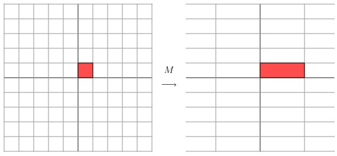

现在看下矩阵：

$$
M=
\begin{bmatrix}
 2\quad 1\\
 1\quad 2 \\
\end{bmatrix}
$$

这个矩阵产生的变换效果如下图所示:

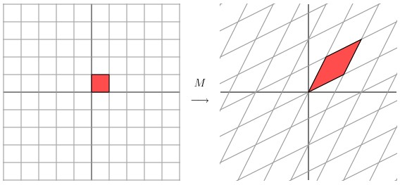

这种变换效果看起来非常的奇怪，在实际环境下很难描述出来变换的规律 ( 这里应该是指无法清晰辨识出旋转的角度，拉伸的倍数之类的信息)。还是基于上面的对称矩阵，假设我们把左边的平面旋转45度角，然后再进行矩阵M 的线性变换，效果如下图所示：

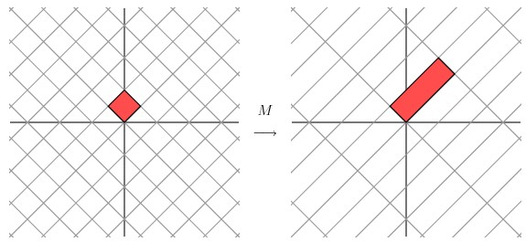

看起来是不是有点熟悉？ 对的，经过 M 线性变换后，跟前面的对角矩阵的功能是相同的，都是将网格沿着一个方向拉伸了3倍。
这里的 M 是一个特例，因为它是对称的。非特殊的就是我们在实际应用中经常遇见一些 非对称的，非方阵的矩阵。如上图所示，如果我们有一个 2 X 2 的对称矩阵M 的话，我们先将网格平面旋转一定的角度，M 的变换效果就是在两个维度上进行拉伸变换了。

用更加数学的方式进行表示的话，给定一个对称矩阵 M ，我们可以找到一些相互正交 $V_i$ ，满足 $MV_i$ 就是沿着 $V_i$ 方向的拉伸变换，公式如下：

$$
Mv_i=\lambda _iv_i
$$

这里的 $\lambda _i$是拉伸尺度(scalar)。从几何上看，M 对向量 $V_i$ 进行了拉伸，映射变换。$V_i$ 称作矩阵 M 的特征向量(eigenvector)，$\lambda _i$ 称作为矩阵M 特征值(eigenvalue)。这里有一个非常重要的定理，对称矩阵M 的特征向量是相互正交的。

如果我们用这些特征向量对网格平面进行线性变换的话，再通过 M 矩阵对网格平面进行线性换的效果跟对M 矩阵的特征向量进行线性变换的效果是一样的。
对于更为普通的矩阵而言，我们该怎么做才能让一个原来就是相互垂直的网格平面(orthogonal grid), 线性变换成另外一个网格平面同样垂直呢？PS：这里的垂直如图所示，就是两根交错的线条是垂直的。

$$
M=
\begin{bmatrix}
 1\quad 1\\
 0\quad 1 \\
\end{bmatrix}
$$

经过上述矩阵变换以后的效果如图:

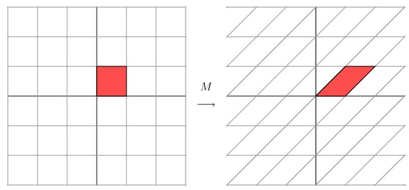

从图中可以看出，并没有达到我们想要的效果。我们把网格平面旋转 30 度角的话，然后再进行同样的线性变换以后的效果，如下图所示

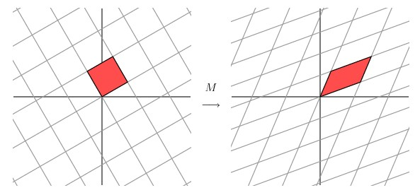

让我们来看下网格平面旋转60度角的时候的效果。

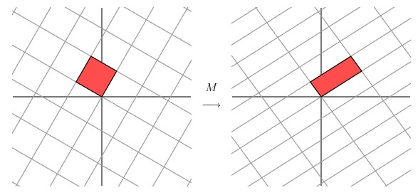

嗯嗯，这个看起来挺不错的样子。如果在精确一点的话，应该把网格平面旋转 58.28 度才能达到理想的效果。

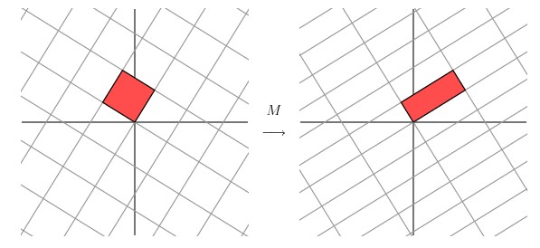

## 2 几何意义

该部分是从几何层面上去理解二维的SVD：对于任意的 2 x 2 矩阵，通过SVD可以将一个相互垂直的网格(orthogonal grid)变换到另外一个相互垂直的网格。
我们可以通过向量的方式来描述这个事实: 首先，选择两个相互正交的单位向量 $v_1$和 $v_2$, 向量 $Mv_1$ 和 $Mv_2$ 正交。

$u_1$ 和 $u_2$ 分别表示 $Mv_1$ 和 $Mv_2$ 的单位向量，$σ\_1 _u\_1 = Mv\_1$和$σ\_2_ u\_2 = Mv\_2$。$σ\_1$和$σ\_2$分别表示这不同方向向量上的模，也称作为矩阵M 的奇异值。

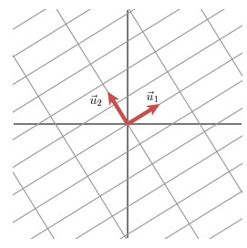

这样我们就有了如下关系式：

$$
Mv_1 = σ_1u_1 \\
Mv_2 = σ_2u_2
$$

我们现在可以简单描述下经过 M 线性变换后的向量 x 的表达形式。由于向量 $v_1$ 和 $v_2$ 是正交的单位向量，我们可以得到如下式子

$$
x = (v_1x)v_1 + (v_2x)v_2
$$

这就意味着：

$$
Mx = (v_1x)Mv_1 + (v_2x)Mv_2    \\
     Mx = (v_1x) σ_1u_1 + (v_2x) σ_2u_2
$$

向量内积可以用向量的转置来表示，如下所示:

$$
V. x= V^Tx
$$

最终的式子为:

$$
Mx = u_1σ_1 v_1^Tx + u_2σ_2 v_2^Tx   \\
M =u_1σ_1 v_1^T + u_2σ_2 v_2^T
$$

上述的式子经常表示成

$$
M = U\sum V^T
$$

u 矩阵的列向量分别是 $u_1,u_2，\sum$是一个对角矩阵，对角元素分别是对应的 $σ_1$ 和 $σ_2$ ，V矩阵的列向量分别是 $v_1,v_2$ 。上角标T 表示矩阵 V 的转置。

这就表明任意的矩阵 M 是可以分解成三个矩阵。V表示了原始域的标准正交基，u 表示经过M 变换后的co-domain的标准正交基，Σ表示了V 中的向量与u中相对应向量之间的关系。(V describes an orthonormal basis in the domain, and U describes an orthonormal basis in the co-domain, and Σ describes how much the vectors in V are stretched to give the vectors in U.)

## 3 奇异值分解的物理意义

此部分转载自知乎 [奇异值分解物理意义，郑宁的回答](https://www.zhihu.com/question/22237507/answer/28007137)

矩阵的奇异值是一个数学意义上的概念，一般是由奇异值分解（Singular Value Decomposition，简称SVD分解）得到。如果要问奇异值表示什么物理意义，那么就必须考虑在不同的实际工程应用中奇异值所对应的含义。下面先尽量避开严格的数学符号推导，直观的从一张图片出发，让我们来看看奇异值代表什么意义。

这是女神上野树里（Ueno Juri）的一张照片，像素为高度450\*宽度333

我们都知道，图片实际上对应着一个矩阵，矩阵的大小就是像素大小，比如这张图对应的矩阵阶数就是450\*333，矩阵上每个元素的数值对应着像素值。我们记这个像素矩阵为 $A$ 。

现在我们对矩阵 $A$ 进行奇异值分解。直观上，奇异值分解将矩阵分解成若干个秩一矩阵之和，用公式表示就是：

$$
A =\sigma_1\mu_1v_1^T+\sigma_2\mu_2v_2^T+...+\sigma_r\mu_rv_r^T
$$

其中等式右边每一项前的系数 $\sigma$就是奇异值，u和v分别表示列向量，秩一矩阵的意思是矩阵秩为1。注意到每一项 $\mu v$ 都是秩为1的矩阵。我们假定奇异值满足:

$$
\sigma_1\ge\sigma_2\ge....\sigma_r\ge0
$$

（奇异值大于0是个重要的性质，但这里先别在意），如果不满足的话重新排列顺序即可，这无非是编号顺序的问题。

既然奇异值有从大到小排列的顺序，我们自然要问，如果只保留大的奇异值，舍去较小的奇异值，这样(1)式里的等式自然不再成立，那会得到怎样的矩阵——也就是图像？

令 $A_1=\sigma_1 u_1v_1^{\rm T}$ ，这只保留(1)中等式右边第一项，然后作图

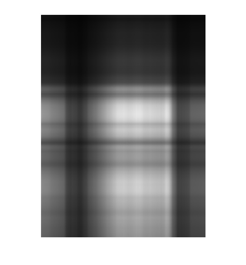

结果就是完全看不清是啥……我们试着多增加几项进来:

$$
A_5 =\sigma_1\mu_1v_1^T+\sigma_2\mu_2v_2^T+...+\sigma_5\mu_5v_5^T
$$

再作图

隐约可以辨别这是短发伽椰子的脸……但还是很模糊，毕竟我们只取了5个奇异值而已。下面我们取20个奇异值试试，也就是(1)式等式右边取前20项构成 $A_{20}$

虽然还有些马赛克般的模糊，但我们总算能辨别出这是Juri酱的脸。当我们取到(1)式等式右边前50项时：

我们得到和原图差别不大的图像。也就是说当k从1不断增大时，A\_k不断的逼近A。让我们回到公式

$$
A =\sigma_1\mu_1v_1^T+\sigma_2\mu_2v_2^T+...+\sigma_r\mu_rv_r^T
$$

矩阵表示一个450_333的矩阵，需要保存个元素的值。等式右边和分别是450_1和333\*1的向量，每一项有个元素。如果我们要存储很多高清的图片，而又受限于存储空间的限制，在尽可能保证图像可被识别的精度的前提下，我们可以保留奇异值较大的若干项，舍去奇异值较小的项即可。例如在上面的例子中，如果我们只保留奇异值分解的前50项，则需要存储的元素为，和存储原始矩阵相比，存储量仅为后者的26%。

**奇异值往往对应着矩阵中隐含的重要信息，且重要性和奇异值大小正相关。每个矩阵A都可以表示为一系列秩为1的“小矩阵”之和，而奇异值则衡量了这些“小矩阵”对于A的权重。**

在图像处理领域，奇异值不仅可以应用在数据压缩上，还可以对图像去噪。如果一副图像包含噪声，我们有理由相信那些较小的奇异值就是由于噪声引起的。当我们强行令这些较小的奇异值为0时，就可以去除图片中的噪声。如下是一张25\*15的图像（本例来源于\[1\]）

但往往我们只能得到如下带有噪声的图像（和无噪声图像相比，下图的部分白格子中带有灰色）：

通过奇异值分解，我们发现矩阵的奇异值从大到小分别为：14.15，4.67，3.00，0.21，……，0.05。除了前3个奇异值较大以外，其余奇异值相比之下都很小。强行令这些小奇异值为0，然后只用前3个奇异值构造新的矩阵，得到

可以明显看出噪声减少了（白格子上灰白相间的图案减少了）。

奇异值分解还广泛的用于主成分分析（Principle Component Analysis，简称PCA）和推荐系统（如Netflex的电影推荐系统）等。在这些应用领域，奇异值也有相应的意义

## 4 如何获得奇异值分解

事实上我们可以找到任何矩阵的奇异值分解，那么我们是如何做到的呢？假设在原始域中有一个单位圆，如下图所示。经过 M 矩阵变换以后在co-domain中单位圆会变成一个椭圆，它的长轴(Mv1)和短轴(Mv2)分别对应转换后的两个标准正交向量，也是在椭圆范围内最长和最短的两个向量。

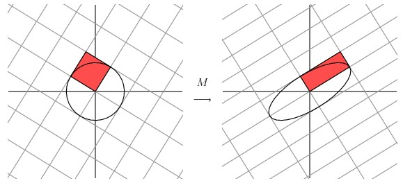

换句话说，定义在单位圆上的函数|Mx|分别在 $v_1$ 和 $v_2$ 方向上取得最大和最小值。这样我们就把寻找矩阵的奇异值分解过程缩小到了优化函数|Mx|上了。结果发现（具体的推到过程这里就不详细介绍了）这个函数取得最优值的向量分别是矩阵 MT M 的特征向量。由于MTM是对称矩阵，因此不同特征值对应的特征向量都是互相正交的，我们用 $v_i$ 表示MTM的所有特征向量。奇异值 $σ_i = |Mv_i|$， 向量 $u_i$ 为 $Mv_i$ 方向上的单位向量。但为什么 $u_i$ 也是正交的呢？

推倒如下：

$σ_i$ 和 $σ_j$ 分别是不同两个奇异值

$$
Mv_i = σ_iu_i  \\
Mv_j = σ_ju_j.
$$

我们先看下MviMvj，并假设它们分别对应的奇异值都不为零。一方面这个表达的值为0，推到如下

$$
Mv_i Mv_j = v_i^TM^T Mv_j = v_i M^TMv_j = λ_jv_i v_j = 0
$$

另一方面，我们有

$$
Mv_i Mv_j = σ_iσ_j u_i u_j = 0
$$

因此，$u_i$ 和 $u_j$ 是正交的。但实际上，这并非是求解奇异值的方法，效率会非常低。这里也主要不是讨论如何求解奇异值，为了演示方便，采用的都是二阶矩阵。

## 5 应用实例

### 5.1 应用实例一

$$
M =
  \begin{bmatrix}
   1\quad 1 \\
   2\quad 2 \\
  \end{bmatrix}
$$

经过这个矩阵变换后的效果如下图所示

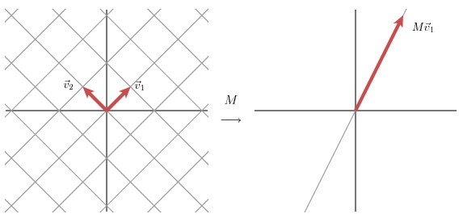

在这个例子中，第二个奇异值为 0，因此经过变换后只有一个方向上有表达

$$
M =u_1σ_1 v_1^T
$$

换句话说，如果某些奇异值非常小的话，其相对应的几项就可以不同出现在矩阵 M 的分解式中。因此，我们可以看到矩阵 M 的秩的大小等于非零奇异值的个数。

### 5.2 应用实例二

我们来看一个奇异值分解在数据表达上的应用。假设我们有如下的一张 15 x 25 的图像数据。

如图所示，该图像主要由下面三部分构成。

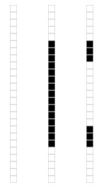

我们将图像表示成 15 x 25 的矩阵，矩阵的元素对应着图像的不同像素，如果像素是白色的话，就取 1，黑色的就取 0. 我们得到了一个具有375个元素的矩阵，如下图所示

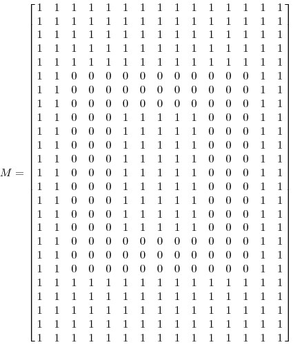

如果我们对矩阵M进行奇异值分解以后，得到奇异值分别是

$$
σ_1 = 14.72 \\
σ_2 = 5.22  \\
σ_3 = 3.31 \\
$$

矩阵M就可以表示成

$$
M=u_1σ_1 v_1^T + u_2σ_2 v_2^T + u_3σ_3 v_3^T
$$

$v_i$ 具有15个元素，$u_i$ 具有25个元素，$σ_i$ 对应不同的奇异值。如上图所示，我们就可以用123个元素来表示具有375个元素的图像数据了。

### 5.3 应用实例三：减噪(noise reduction)

前面的例子的奇异值都不为零，或者都还算比较大，下面我们来探索一下拥有零或者非常小的奇异值的情况。通常来讲，大的奇异值对应的部分会包含更多的信息。比如，我们有一张扫描的，带有噪声的图像，如下图所示

我们采用跟实例二相同的处理方式处理该扫描图像。得到图像矩阵的奇异值：

$$
σ_1 = 14.15   \\
σ_2 = 4.67     \\
σ_3 = 3.00   \\
σ_4 = 0.21   \\
σ_5 = 0.19  \\
...
σ_15 = 0.05 \\
$$

很明显，前面三个奇异值远远比后面的奇异值要大，这样矩阵 M 的分解方式就可以如下：

$$
M \approx  u_1σ_1 v_1^T + u_2σ_2 v_2^T + u_3σ_3 v_3^T
$$

经过奇异值分解后，我们得到了一张降噪后的图像。

### 5.4 应用实例四：数据分析(data analysis)

我们搜集的数据中总是存在噪声：无论采用的设备多精密，方法有多好，总是会存在一些误差的。如果你们还记得上文提到的，大的奇异值对应了矩阵中的主要信息的话，运用SVD进行数据分析，提取其中的主要部分的话，还是相当合理的。
作为例子，假如我们搜集的数据如下所示：

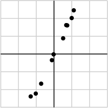

我们将数据用矩阵的形式表示：

经过奇异值分解后，得到

$$
σ_1 = 6.04  \\
σ_2 = 0.22 \\
$$

由于第一个奇异值远比第二个要大，数据中有包含一些噪声，第二个奇异值在原始矩阵分解相对应的部分可以忽略。经过SVD分解后，保留了主要样本点如图所示

就保留主要样本数据来看，该过程跟PCA( principal component analysis)技术有一些联系，PCA也使用了SVD去检测数据间依赖和冗余信息.
