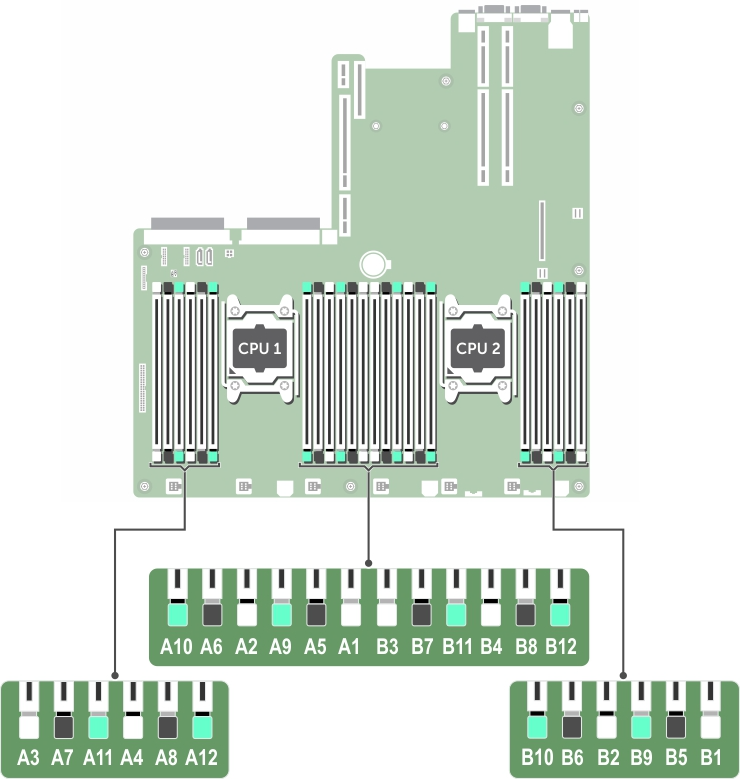
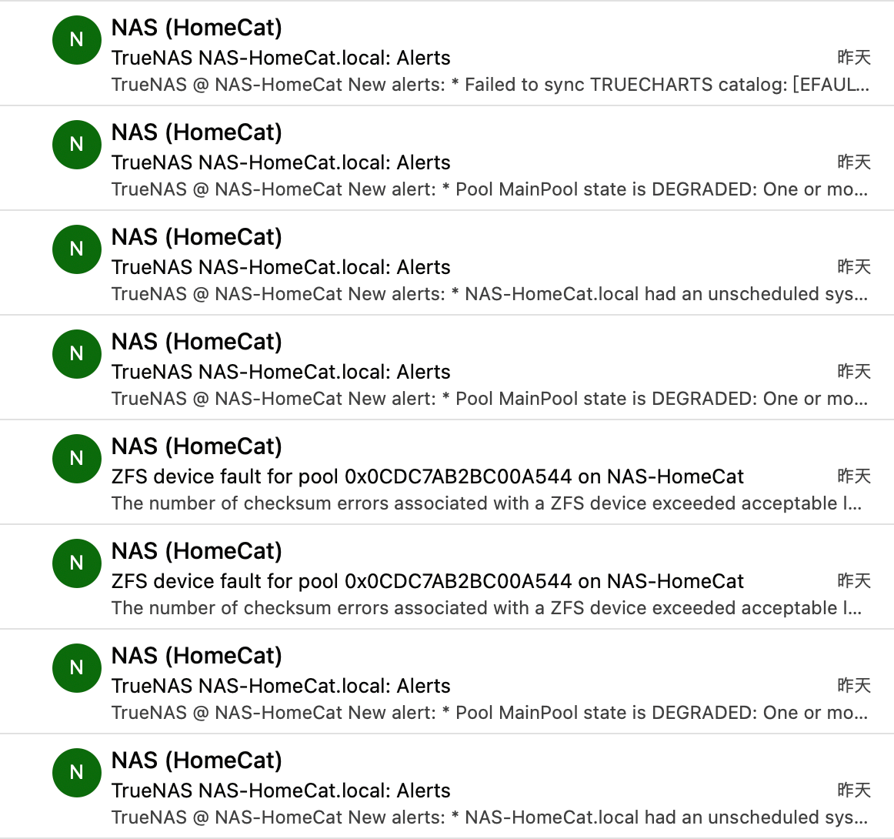

# 记一次升级内存导致的服务不可用和硬盘数据错误

## 升级缘由

::: danger First thing first
- **数据无价，谨慎操作。**
- **不要在你不清楚完整后果的情况下尝试修复系统错误。**
:::

起初问题不是很明显，我在为小音 @LittleSound 创建上 GAMES101 课程所需要的 Ubuntu 虚拟环境的时候发现 Hyper-V 中的内存压力较高，而恰好压力和占用较高的又是家里的 Kubernetes 集群节点和 TrueNAS SCALE 虚拟机，于是希望尽快为整个服务器进行内存扩容。

::: tip
关于配置这个虚拟环境，也遭遇了很多有趣的事情，可以查阅 [为在 Hyper-V 上运行的 Ubuntu 18.04 虚拟机修复卡顿、提高刷新率和提供可变分辨率](../../%F0%9F%AA%9F%20Windows/%E4%B8%BA%E5%9C%A8%20Hyper-V%20%E4%B8%8A%E8%BF%90%E8%A1%8C%E7%9A%84%20Ubuntu%2018.04%20%E8%99%9A%E6%8B%9F%E6%9C%BA%E4%BF%AE%E5%A4%8D%E5%8D%A1%E9%A1%BF%E3%80%81%E6%8F%90%E9%AB%98%E5%88%B7%E6%96%B0%E7%8E%87%E5%92%8C%E6%8F%90%E4%BE%9B%E5%8F%AF%E5%8F%98%E5%88%86%E8%BE%A8%E7%8E%87.md) 这篇知识库文档来了解更多我和 Hyper-V 大战的情况。
:::

毕竟一般的最佳实践是期望内存占用不要超过 50%，我期望扩容后不要超 60%（当时已经接近 80% 了），所以我预订了 6 条镁光的 DDR4 16G ECC 内存条来给 Homelab 服务器进行升级。之前有安装过不少内存条，服务器整体内存可用量为 160GB，装 6 条新的内存条之后应该是到 256GB。

升级当然很简单就是了，还顺便给 Homelab 服务器 R730 进行了例行的清灰和打理工作，这也能确保内存条安装和插入的时候不会遇到奇怪的接触不良问题和静电造成的额外损坏，按照 [Dell R730 Owner's Manual](https://www.dell.com/support/manuals/zh-hk/poweredge-r730/r730_ompublication/%E4%B8%80%E8%88%AC%E5%86%85%E5%AD%98%E6%A8%A1%E5%9D%97%E5%AE%89%E8%A3%85%E5%8E%9F%E5%88%99?guid=guid-770a902d-9e4f-440e-a77d-b6abc3308396&lang=zh-cn) 中的指示，继续对内存条按色别进行填充。

## 问题开始

### 问题一：B2 内存故障

不巧的是，填充之后第一次 Boot 进 BIOS 就遇到了错误，提示 B2 slot 有故障，因为 B2 是之前就存在的内存条，我想应该不会有问题，于是在 BIOS 中尝试选择 Retry and Boot 的选项之后试图进入到 Windows。尝试很成功，确实能 Boot 到 Windows，这个时候通过在 PowerShell 中执行 `wimc memorychip`  查看现在系统读取和加载的内存，看看能不能重新尝试加载到 B2 slot，结果发现确实是 B2 slot 的内存缺失了，这就奇怪了，也许是安装 B6 slot（B6 slot 就在 B2 slot 旁边，布局可参见下图）的时候清理导致了什么接触不良的问题（怎么这种问题还是被我给碰上了？），那也只有拆开看看才知道了。

内存布局

这个时候我拆开了盖板希望给 B2 内存调试看看，也同步在 Twitter 上发了一条评论状态来吐槽自己的困境，但我殊不知，其实这只是问题的开始...

吐槽

我拆开之后给 B2 slot 的内存条擦拭擦拭之后又安装了回去，寄希望于它不会出现问题。与我预想的是一样的，这一次 BIOS 确实能正确 Configure Memory 了，Boot 进入到 Windows Server 之后用 `wimc memorychip` 也能查看到先前遗失的 B2 内存条，在任务管理器的性能 Tab - 内存 Select 下也能看到是满足了 256GB 整体可用内存的预期。

### 问题二：硬盘空间不足

就在我在 Windows Admin Center 为 Kubernetes 集群的节点 VM 进行内存扩容之后，我尝试等待了一段时间期望 KubeSphere 和 TrueNAS SCALE（每次我都会主动检查一下 NAS 的 Pool 状态以确保维护流程不会影响到 Pool 健康度）的 Web UI 面板上线，结果 10 分钟过去了，我依然没有等到期望的结果，等到我决定在 Windows Admin Center 上查看虚拟机列表的时候才发现原先正常运行的 Hyper-V 虚拟机都没办法恢复了，但是 Windows Admin Center 的报错太模糊了，只有简单的错误短语和 ID，没办法了解具体的错误，于是我打算用 Microsoft RDP 连接到 Windows Server 去更进一步调查。

出乎我意料的是，似乎是之前更早一些的时候引入的资源导致硬盘太极限了，加上 VM Snapshot + VM VHDX 确实变大了，Hyper-V 给我的报错是：**磁盘资源不足**（只剩下 25G）。好在我前天就购买了硬盘，理论上很快就能寄到了。

这个时候距离我开始维护 Homelab 服务器已经 T+35min 了，跑在 Kubernetes 的公共服务也已经离线了接近 40 分钟，我只能尽快寻找办法解决这个硬盘的问题。起初我寄希望于清理掉部分 Hyper-V 的快照来赢得部分的存储空间（清理出来了 3G），但是可惜的是依然不够，为了能够把 Kubernetes 的主节点拉起来似乎还需要更多，更别提还有 TrueNAS SCALE 没有拉起来，以及小音和家里的伙伴需要使用的 Docker 上运行的内部服务和 Home Assistant 也都没拉起来。我想起来先前在进行 Kubernetes 的创建的时候留了一部分没有使用到的 VHDX 虚拟磁盘文件，遂去找到它们然后进行一个删除操作。幸运的是，确实累计清理出来了不少空间，也确实勉勉强强把除去小音先前需要的 Ubuntu 虚拟机之外的所有 VM 给拉起来了，至此家里和公共的 infra 都已经正常，没有损坏，只是耗时较久。

但，这些相比起接下来我遭遇的其实都是不痛不痒的问题...

### 问题三：B6 内存故障

就在我刚结束修复 B2 内存问题和 C 盘磁盘空间不足的问题以及成功将必要的服务和 VM 拉起来之后，服务器突然离线，再次开机之后 BIOS 开始报错：**B6 slot 内存故障**。

这个时候我都要被吓坏了，难道是主板出了什么问题吗？难道是我清理的时候造成了什么损害吗？考虑到刚才我修复 B2 的时候也把 B6 拆开擦了擦和清理了一下，没有正确控制变量，可能是哪里有问题，于是我把 B6 也重新拔出来重新插紧了放了回去，希望看看 BIOS 能不能 Configure Memory 跑起来。

和之前调试 B2 的时候遭遇的情况一样，重新擦一擦就好了，BIOS 也没说什么问题，我怕接下来又有什么故障，所以服务器盖板没有盖回去，而是~~先去卫生间释放了一下紧张的压力~~，好巧不巧，我刚去卫生间就听到外面的服务器开始大声轰鸣，比以往开机的声音都要大，就像是小孩子急了开始大声哭啼似的，于是我也没有耽误太久，赶紧洗个手擦干净出来看具体的情况。

结果眼前的情况超出了我的预期：BIOS 确实能 Configure Memory，也确实能加载 Lifecycle Controller，Windows Server 也能跑起来，但是每当 Windows Server 进入可登录的状态之后服务器都会开始轰鸣，然后黑屏，进入往复的重启过程，而我寄希望于能通过 iDRAC 面板查看系统日志了解是哪里出现了情况，可惜的是，这个时候 iDRAC 是离线的！没办法访问！那我怎么办，在 Windows Server 和 BIOS 连续挂了 3 次 + reboot 3 次之后我决定手动在下一次黑屏之后断电来亲自排查问题。

断电后让我们冷静下来思考，B2 slot 和 B6 slot 有问题，会不会是我插错位置了，我反复阅读了盖板上的指南，看到它确实写了 1, 2, 3, 4, 5... 的内存排列，说 ECC 的情况下应该是 (1,2), (3,4) ... 的排列，这个时候我一度怀疑我自己记错了 R730 的内存安装和组合方式：按色别填充，然后不记得我是不是病急乱投医了，在某个 Dell 官方文档中查到了应该是按照 B1, B5, B9（物理顺序）去插，我也确实一度去把 A 列和 B 列的内存全部拔出来然后重新按照物理意义上的内存条排列的顺序插，然后插着插着觉得不对劲，不应该是随便找的文档，我应该看 Owner's Manual，然后看到 Owner's Manual 中写了这么一行[^1]：

> 首先填充所有带白色释放卡舌的插槽，然后填充带黑色释放卡舌的插槽，最后填充带绿色释放卡舌的插槽。

这和我印象中的一年前阅读过的指南是一样的，我也庆幸我没有自己乱来然后造成更大的破坏，于是选择把已经重新排列了一部分的内存条重新排列回去，然后尝试把 B2 和 B6 的内存条调换一下位置希望碰碰运气。

好运的是，内存条确实能完整的被识别了，BIOS 没报错，系统也没报错，Windows Server 加载之后也没有什么异常状况，风扇声音也不像之前那样忽大忽小。接下来只需要进入到 Hyper-V 中确保各个 VM 都正常运行就好了。

**...吗？**

### 问题四：硬盘数据损坏

这真的是我从未预想过的情况，就在 VM 运行正常之后，我接连收到了 TrueNAS SCALE 给我发的满屏幕的邮件告警：

- MainPool DEGRADED
- checksum error exceeded - data corrupted

我的天哪，这个时候我已经麻了，时间是北京时间下午 13:13，我为了升级内存，一直没吃饭，一直在遭遇问题，而下午还要受朋友的邀请去聚会玩耍，我当时就是满心的：

🤯🤯🤯

我想着，行吧行吧，Degraded 就 Degraded，我先吃饭，能有什么大不了的呢？

等我吃完饭回来我发现这里面问题比我想象的复杂...

首先，我在 TrueNAS 看到的硬盘提供商由原先的西部数据硬盘的序列号变成了服务器自带的阵列卡的名字，这不对，而且也有一个告警有提示说 S.M.A.R.T. 测试无法进行，因为不能直接访问到硬盘硬件，也许是由于断电和崩溃太多太频繁导致的数据错误，BIOS 把我之前给 PERC H730 RAID 控制器配置的直通都清空了，这也许是导致 TrueNAS 的问题关键所在，于是我前往 BIOS 对硬盘进行配置，然后再前往 Hyper-V 对硬盘盘 ID 进行重新更新和映射，结果 TrueNAS 还是在报错：checksum error exceeded - data corrupted。

使用 `zpool status -v` 能看到我们的 3 个硬盘全部都报错说 too many errors。那怎么办呢？只能把 Pool 抹了然后重新把之前的 Backup Replicate 到 TrueNAS SCALE 里面。结果... 结果... 我以为开启的 TrueNAS replicate task 其实是空的......

那怎么办呢？只好尽快配置 AWS S3 Glacier 进行冷备份和在新硬盘抵达后还原咯。但差不多得去参加聚会了，没时间折腾了。

### 问题五：NIC Bug 了

就在我在朋友的聚会上休息等待用餐之前，我开始尝试透过内网穿透进行 TrueNAS 的配置和远程拯救的时候，发现就在我运行了 `zpool clear`  和重启了 TrueNAS 之后就无法穿透到家里的网络了...

因为本来朋友家里的 WiFi 信号就是有点弱的，互联网访问也不是很顺畅，于是先请求朋友帮忙看了看他们家里的网络，重新布置 AP 和 WiFi 之后，网络连接改进了很多，结果还是连不上，这个时候去查看 Wireguard 的时候就发现家里的网关已经没有握手了，那也许是电信 QoS 我了，我又去备用的 Tailscale 上查看，结果 Tailscale 也告诉我网关早就离线了。

那，我这个时候就在想，是不是内存出现了问题，会不会出现像之前一样突然内存出错然后崩溃的情况，会不会在我在外面吃饭聚餐的这段时间里一直重启并且进一步损坏硬盘，我当时焦虑爆炸了，和小音说了一下似乎也没有什么办法，打算就这样吧，NAS 里面的数据也不是重要到没了就死了，很大一部分还是我们的 macOS TimeMachine 备份。你也许会问：

**猫猫猫猫，你们家里不是有 OpenWRT 软路由的吗？不可以用较为稳定的 TCP 内网穿透到软路由上进行远程调试吗？**

Oh，你问的好，我只能说我可真是个大聪明，之前我觉得网关最近运行良好，没有再出现过什么异常的问题了，加上 Tailscale 和 Wireguard 配合得十分流畅，于是我**把软路由上的 Wireguard、Zerotier 和 NPS 都关闭了**，寄希望于网关 VM 能运行得好，全仰仗于网关的 Wireguard 和 Tailscale。

**事实证明我就是：🤡。**

那咋办呢？要么打车回家弄要么晚上回家再看咯。我后面也没再想什么了，和朋友一起吃了很好吃的牛排，看了电影，蛮开心的，牛排真的很美味。

等我回家之后发现，嘿，这个 Windows Server 和 Homelab 其实运行的蛮好的，就是 NIC 挂了，Windows Server 自己没感觉自己网断了，所以没发告警，直到我走 VGA 登录进去才发现它又出现了一个之前就有的 NIC Bug。

但说实话，这其实是之前就存在的问题，但我一直没发现如何一劳永逸地解决，找了采购商也是说需要把网卡寄过去，因为觉得 Homelab 蛮重要的，舍不得终止服务几天，所以一直懒着没去搞，也没有痛到需要直接更换 NIC 的程度。行，这次直接给我上了一课，我既没有冗余方案能够连回家里，也没有好好去调试 NIC 的问题，但 NIC 的问题也很好解决就是了：重启。

你才怎么着，重启也不行，也许是之前疯狂重启导致的，Hyper-V 现在没办法控制虚拟交换机了，哪怕网络适配器里面能找到这些 vEthernet 接口也没办法管理，也没办法映射，VM 也都卡在找不到硬件的错误上无法恢复。

得，我重新建立了需要的虚拟交换机，确保和软路由上的 MAC 地址一一对应上和 ARP / IP 绑定正确配置之后（你知道吗，Hyper-V 它知道哪个 MAC 对应的哪个 VM，但是就是虚拟交换机丢失绑定了 🤯）又重新启动了所有的 VM，到这个时候，遇到的问题就几乎都解决了...

...除了 TrueNAS 的数据是真的坏了...

## 尾声

好的，讲到这里，就基本上结束了，这对我而言是一个非常有意思的事故，涉及到很多个方面的问题，也从侧面反映出我在单点系统上考虑的不足和缺少的经验。在数据安全的方面也好，网络冗余的方案也好都考虑的不是很周到，不过即便真的想要做好，反倒是更非常庞大的话题了。Homelab 很难做到很优秀的程度，更别提其实我条件并不是很好，~~我要是能单人 SLA 99.999999% 那我也可以去开 IDC 了~~。

::: warning
希望大家不要像我一样乱操作，也不要像我这样 All in one，因为要是真的爆炸了，是没有很好的办法来恢复的。
:::

我也只能尽量总结经验，对我们目前的架构和方案做一些修修补补：

1. 尽快找时间扩充必要的硬盘资源；
2. 尽快完成 AWS S3 Glacier Deep Archive 的备份；
3. 尽快调查 TrueNAS 数据损坏的受损面；
4. 在软路由上确保有额外的冗余的内网穿透方案（还有我之前想要做的物联网 SIM 卡断网告警）；
5. 尽快更换已经下单的 NIC；
6. 找时间对内存进行压力测试；
7. 未来在维护和迁移的时候不要让 Hyper-V 在条件不充分的时候自动启动 VM 造成级联损伤；
8. 也许可以购置一个智能插座帮忙告警快速的功耗波动？

EDIT:

后来睡觉前我努力把 AWS S3 Glacier 配置上了，也把直连传输备份的 Clash 规则配置好了，之后也会出一篇短文讲讲如何配置这个备份流程和对受损的 TrueNAS 硬盘进行修复（确实是人生第一次了），拭目以待吧！

[^1]: [Dell PowerEdge R730 用户手册 | Dell 香港](https://www.dell.com/support/manuals/zh-hk/poweredge-r730/r730_ompublication/%E4%B8%80%E8%88%AC%E5%86%85%E5%AD%98%E6%A8%A1%E5%9D%97%E5%AE%89%E8%A3%85%E5%8E%9F%E5%88%99?guid=guid-770a902d-9e4f-440e-a77d-b6abc3308396&lang=zh-cn) 的「系统内存」- 「一般内存模块安装原则」中的第 7 条。